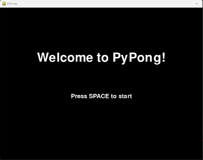
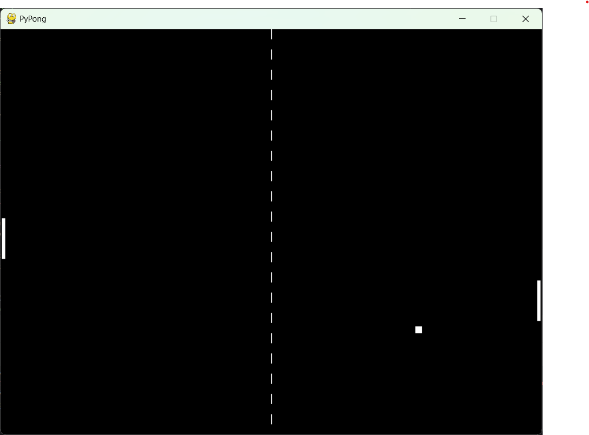

# PyPong 🐍🏓

This is a version of the popular game Pong designed for two human players. It is built in Python using object-oriented programming.



## Contents
1. [Requirements](#requirements)
2. [Installation](#installation)
3. [Running the Game](#running-the-game)
4. [Gameplay](#gameplay)
5. [Configuration](#configuration)
6. [Project Structure](#project-structure)
7. [Future development](#future-development)

## Requirements
- Python 3.8+
- Pygame 2.0+
- PyYaml 6.0+

## Installation

#### Using [environment.yml](environment.yml)
```
# Clone the repository and navigate to the project directory
git clone https://github.com/jplimmer/pypong.git
cd pypong

# Create conda environment from `environment.yml` and activate:
conda env create -f environment.yml
conda activate pypong
```

#### Using [requirements.txt](requirements.txt)
```
# Clone the repository and navigate to the project directory
git clone https://github.com/jplimmer/pypong.git
cd pypong

# Create and activate a virtual environment (optional but recommended)
python -m venv pypong
source pypong/bin/activate  # Windows: pypong\Scripts\activate

# Install the package in development mode
pip install -e .
```

## Running the Game
After installation, you can run the game from the root directory in any of these ways:
```
# Run as a module
python -m pypong

# Or if you installed with pip
pypong
```

## Gameplay
The screen is divided into 2 halves by a net, with Player 1's paddle on the far left and Player 2's paddle on the far right.



At the start of each point the ball will begin moving from a random point on the net in a random direction. The ball will bounce off the top and bottom of the screen, and each player has to move their paddle to hit the ball back towards the opponent. If the ball goes off the left or right hand edge of the screen, the point is over.  

Each player has an up and down key to control their respective paddles. The paddles have 5 speed settings which can be adjusted with more presses of the direction key:
- Player 1 = W/S
- Player 2 = Up/Down

The winner is the first player to score 11 points (with a winning margin of 2).

## Configuration
Game settings such as screen dimensions, winning score and 'win by two' can be adjusted by modifying `config.yaml`.

## Project Structure
```
pypong/
├── pypong/           # Main package
│   ├── __main__.py   # Entry point
│   ├── config/       # Default configuration
│   └── game/         # Game logic
│       ├── objects/  # Game objects (ball, paddle)
│       └── screens/  # Game screens
├── config.yaml       # Configuration file
└── setup.py          # Package setup
```

## Future development
- Add angle variation after paddle hit. 
- Add more user configuration options:
  - difficulty levels (paddle size, ball speeds)
  - colour themes
  - reassign control keys

